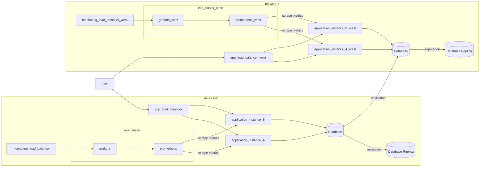

# Infrastructure

## AWS Zones
- Region: us-east-2, availability zones: us-east-2a, us-east-2b, us-east-2c
- Region: us-west-1, availability zones: us-west-1b, us-west-1c

## Servers and Clusters

### Table 1.1 Summary
| Asset                        | Purpose                      | Size                                                                | Qty                               | DR                                                                                                                                                                                       |
|------------------------------|------------------------------|---------------------------------------------------------------------|-----------------------------------|------------------------------------------------------------------------------------------------------------------------------------------------------------------------------------------|
| Load Balancer for app        | Forward traffic to instances | N/A                                                                 | 2                                 | Managed by AWS, replicated 1 instance per region, 2 availability zones per instance                                                                                                      | 
| Load Balancer for monitoring | Forward traffic to instances | N/A                                                                 | 2                                 | Managed by AWS, replicated 1 instance per region, 2 availability zones per instance                                                                                                      | 
| Ubuntu web                   | Business application         | t3.micro                                                            | 4                                 | 2 per region                                                                                                                                                                             |
| EKS cluster                  | Monitoring stack             | 2 nodes in cluster t3.medium                                        | 2 clusters, 1 per each region     | 1 cluster per region                                                                                                                                                                     |
| VPC                          | Virtual network              | N/A                                                                 | 8 IP addresses, 4 for each region | -                                                                                                                                                                                        |                              
| SQL Database                 | Store data                   | db.t2.small                                                         | 2 clusters, each has 2 nodes      | Primary and secondary clusters, replication from us-east-2 to us-west-1, each cluster has multiple availability zones, ensured by AWS. AWS managed backups with retention window 5 days. |                              

### Descriptions
More detailed descriptions of each asset identified above.

#### Load Balancer for app

Is responsible for proxying traffic to application instances using consistent hashing algorithm.
Application is deployed outside K8s cluster, so it has separate load balancer than monitoring stack.

#### Load Balancer for monitoring

Is responsible for proxying traffic to grafana on EKS cluster using round-robin algorithm.

#### Ubuntu web

Single instance of web application, run on Ubuntu system. Application has multiple replicas in the same region to ensure HA.
When one of the instance fails, Load Balancer for app proxies traffic to other replica as soon as it detect that one replica is unhealthy.
Application instance should have endpoint for checking its healthy status by LB.

#### EKS Cluster

Is needed to run and configure all monitoring stack: Grafana and Prometheus.
Each cluster should have minimum 2 nodes. But it is worth to consider configure 3-nodes cluster to be reliable in case of network split in one of the region.
Each region has own cluster with same configuration.

#### VPC
It gives us full control over our virtual networking environment in each region. Each VPC has multiple IP addresses
across multiple availability zones.

#### SQL Database

Is responsible for storing data processed by web application. This is a relational database with replication.
Primary instance supports RW operations and secondary is RO. In case of failure of primary instance, secondary takes over role of primary replica.
DB instance is run on AWS by RDS service and should have configured automatically backups with retention window 5 days.

Whole system diagram:

## DR Plan
### Pre-Steps:

1. prepare infrastructure as a code project using Terraform tool
2. prepare infrastructure configuration per region us-east-2 
   - create vpc module and configure network in us-east-2, public and private subnets, routes and route table associations
   - create ec2 module and define all specific per region resources. Application instances will be run on them
   - create eks module and configure cluster managed by AWS. Monitoring tools - Prometheus, Grafana will be deployed on it
   - create modules for primary and secondary database instances 
3. repeat above steps for region us-west-1

## Steps:

| Failed component          | Failover scenario                                                                                                                               |
|---------------------------|-------------------------------------------------------------------------------------------------------------------------------------------------|
| monitoring load balancer  | AWS guarantees high availability by multiple zones in region                                                                                    |
| grafana                   | Kubernetes guarantees new pod with grafana will be started                                                                                      |
| prometheus                | Kubernetes guarantees new pod with prometheus will be started                                                                                   |
| K8s node                  | Application will be recreated on another node                                                                                                   |
| EKS cluster               | This probably means that whole region is down, detailed scenario below                                                                          | 
| application load balancer | AWS guarantees high availability by multiple zones in region                                                                                    |
| application instance      | Applications is run in HA configuration, so second replica handles user's requests                                                              |
| Primary database          | Switch to secondary database and secondary becomes primary                                                                                      |
| Secondary database        | Assuming that it allows only read operations, primary instance is RWO and will handle all requests                                              |
| region down               | Traffic is sent to another region, change IP address configuration or switch on domain or configure multihoming to automatically switch traffic |

-----
To consider: Introduce multihoming mechanism, which improve reliability in case if one of region will fail.
Then web site domain that is used by users has IP address which can be moved from one region to another if necessary.
Then we should ensure additional VPC to support connectivity across both regions.